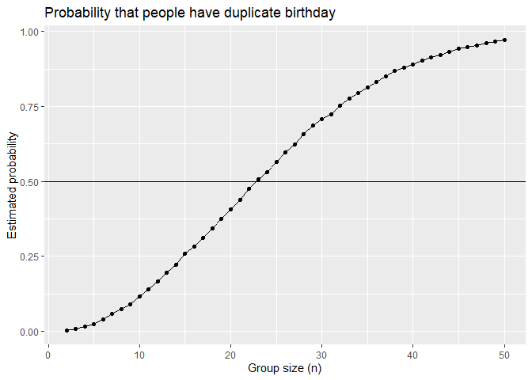
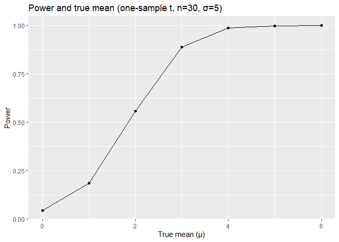
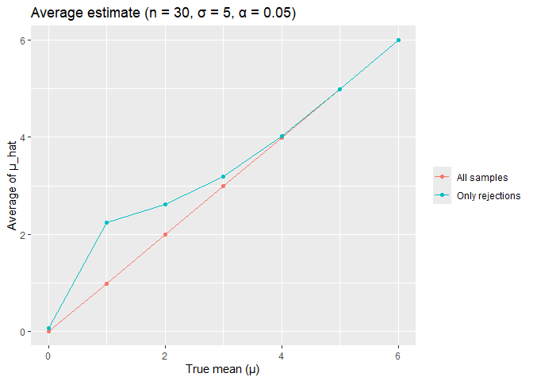

p8105_hw5_yg3096
================

## Problem 1

``` r
check <- function(n) {
         any(duplicated(sample.int(365, size = n, replace = TRUE)))
}

# For group size of 2-50, run simulation 10000 times for each size
n_size <- 2:50
prob <- numeric(length(n_size))
for (i in seq_along(n_size)) {
    n <- n_size[i]
    prob[i] <- mean(replicate(10000, check(n)))
}
sim <- data.frame(n = n_size, prob = prob)

# Plot showing probability and group size
sim |>
    ggplot(aes(x = n, y = prob)) + geom_line() + geom_point() +
    geom_hline(yintercept = 0.5) +
    labs(title = "Probability that people have duplicate birthday", 
         x = "Group size (n)", y = "Estimated probability")
```

<!-- -->

The probability of more than one people share the same birthday
increases  
rapidly as group size grows, and this probability exceeds 50% at group
size of  
around 23.

## Problem 2

``` r
n <- 30
sigma <- 5
n_mu <- 0:6
alpha <- 0.05

# Simulation for a certain mu_true, return estimate and p-value
simulate <- function(mu_true) {
            x <- rnorm(n, mean = mu_true, sd = sigma)
            tt <- t.test(x, mu = 0)
            c(estimate = unname(tt$estimate), p.value = tt$p.value, 
              mu_true = mu_true)
}

# Simulation for all mu_true
result_list <- vector("list", length(n_mu))
for (i in seq_along(n_mu)) {
    mu <- n_mu[i]
    one_mu <- replicate(5000, simulate(mu), simplify = FALSE)
    result_list[[i]] <- bind_rows(one_mu)
}
# 7*5000 rows with 3 columns, estimate, p-value and mu_true 
sim_raw <- bind_rows(result_list)

# Calculate power
power_df <- sim_raw |>
            group_by(mu_true) |>
            summarise(power = mean(p.value < alpha), .groups = "drop")

# Calculate estimate mean
estimate_df <- sim_raw |>
               group_by(mu_true) |>
               summarise(mean_est = mean(estimate), 
                         mean_est_reject = mean(estimate[p.value < alpha]),
                         .groups = "drop")

# Plot of power and true mean
power_df |>
         ggplot(aes(x = mu_true, y = power)) + geom_line() + geom_point() +
         labs(title = "Power and true mean (one-sample t, n=30, σ=5)",
              x = "True mean (μ)", y = "Power")
```

<!-- -->

In general the power of test increases as the effect size grows. When
the effect  
size is 1, the power is about 0.2, and increases significantly as the
effect  
size grows. For the effect size of 4, 5 and 6, the power is close to 1
and  
increase of power became minimal.

``` r
# Calculate mean in all sample and rejected sample
estimate_long <- estimate_df |>
                 pivot_longer(cols = c(mean_est, mean_est_reject), 
                              names_to = "type", values_to = "mean_hat") |>
                 mutate(type = recode(type, mean_est = "All samples",
                                      mean_est_reject = "Only rejections"))

# Plot of average estimate of sample mean and true mean
estimate_long |>
              ggplot(aes(x = mu_true, y = mean_hat, color = type)) +
              geom_line() + geom_point() + 
              labs(title = "Average estimate (n = 30, σ = 5, α = 0.05)",
                   x = "True mean (μ)", y = "Average of μ_hat") +
              theme(legend.title = element_blank())
```

<!-- -->

When μ is small (1 or 2), the sample average of μ_hat for those the null
is  
rejected is generally greater than the true value of μ, and as the value
of μ  
increases, the sample average of μ_hat converges to the true value of μ.
This is  
because the bias in selection, when take estimates only in rejections,
μ_hat  
with greater absolute value will tend to be selected, thus the result
is  
generally greater than the true value of μ, when μ and power increases,
more  
samples become significant, the difference converges to 0.

## Problem 3

``` r
# Read data
homi <- readr::read_csv("data/homicide-data.csv", show_col_types = FALSE) |>
        clean_names()
glimpse(homi)
```

    ## Rows: 52,179
    ## Columns: 12
    ## $ uid           <chr> "Alb-000001", "Alb-000002", "Alb-000003", "Alb-000004", …
    ## $ reported_date <dbl> 20100504, 20100216, 20100601, 20100101, 20100102, 201001…
    ## $ victim_last   <chr> "GARCIA", "MONTOYA", "SATTERFIELD", "MENDIOLA", "MULA", …
    ## $ victim_first  <chr> "JUAN", "CAMERON", "VIVIANA", "CARLOS", "VIVIAN", "GERAL…
    ## $ victim_race   <chr> "Hispanic", "Hispanic", "White", "Hispanic", "White", "W…
    ## $ victim_age    <chr> "78", "17", "15", "32", "72", "91", "52", "52", "56", "4…
    ## $ victim_sex    <chr> "Male", "Male", "Female", "Male", "Female", "Female", "M…
    ## $ city          <chr> "Albuquerque", "Albuquerque", "Albuquerque", "Albuquerqu…
    ## $ state         <chr> "NM", "NM", "NM", "NM", "NM", "NM", "NM", "NM", "NM", "N…
    ## $ lat           <dbl> 35.09579, 35.05681, 35.08609, 35.07849, 35.13036, 35.151…
    ## $ lon           <dbl> -106.5386, -106.7153, -106.6956, -106.5561, -106.5810, -…
    ## $ disposition   <chr> "Closed without arrest", "Closed by arrest", "Closed wit…

Raw data contains 52179 records and 12 variables, covering 50 cities.

``` r
homi2 <- homi |>
         mutate(city_state = str_c(city, ", ", state),
         # Unsolved: closed without arrest or Open/No arrest
         unsolved = disposition %in% c("Closed without arrest", 
                                       "Open/No arrest"))

city_summary <- homi2 |>
                group_by(city_state) |>
                summarise(n_total = n(), n_unsolved = sum(unsolved), 
                          .groups = "drop") |>
                arrange(desc(n_total))
head(city_summary)
```

    ## # A tibble: 6 × 3
    ##   city_state       n_total n_unsolved
    ##   <chr>              <int>      <int>
    ## 1 Chicago, IL         5535       4073
    ## 2 Philadelphia, PA    3037       1360
    ## 3 Houston, TX         2942       1493
    ## 4 Baltimore, MD       2827       1825
    ## 5 Detroit, MI         2519       1482
    ## 6 Los Angeles, CA     2257       1106

``` r
# Filter data od Baltimore
balti <- homi2 |> filter(city == "Baltimore", state == "MD")
balti_test <- prop.test(x = sum(balti$unsolved), n = nrow(balti))
balti_tidy <- tidy(balti_test) |>
              select(estimate, conf.low, conf.high, p.value)
balti_tidy
```

    ## # A tibble: 1 × 4
    ##   estimate conf.low conf.high  p.value
    ##      <dbl>    <dbl>     <dbl>    <dbl>
    ## 1    0.646    0.628     0.663 6.46e-54

``` r
city_prop <- homi2 |>
             group_by(city_state) |>
             summarise(n_unsolved = sum(unsolved), n_total = n(), 
                       .groups = "drop") |>
             mutate(test = map2(n_unsolved, n_total, 
                                ~ tidy(prop.test(.x, .y)))) |>
             unnest(test) |>
             select(city_state, n_total, n_unsolved, estimate, conf.low, 
                    conf.high)
```

    ## Warning: There was 1 warning in `mutate()`.
    ## ℹ In argument: `test = map2(n_unsolved, n_total, ~tidy(prop.test(.x, .y)))`.
    ## Caused by warning in `prop.test()`:
    ## ! Chi-squared approximation may be incorrect

``` r
head(city_prop)
```

    ## # A tibble: 6 × 6
    ##   city_state      n_total n_unsolved estimate conf.low conf.high
    ##   <chr>             <int>      <int>    <dbl>    <dbl>     <dbl>
    ## 1 Albuquerque, NM     378        146    0.386    0.337     0.438
    ## 2 Atlanta, GA         973        373    0.383    0.353     0.415
    ## 3 Baltimore, MD      2827       1825    0.646    0.628     0.663
    ## 4 Baton Rouge, LA     424        196    0.462    0.414     0.511
    ## 5 Birmingham, AL      800        347    0.434    0.399     0.469
    ## 6 Boston, MA          614        310    0.505    0.465     0.545

``` r
# Plot of proportion for unsolved homicides by city
p_city <- city_prop |>
          mutate(city_state = fct_reorder(city_state, estimate)) |>
          ggplot(aes(x = estimate, y = city_state)) +
          geom_point() +
          geom_errorbarh(aes(xmin = conf.low, xmax = conf.high), height = 0.1) +
          labs(title = "Proportion of unsolved homicides by city (95% CI)",
               x = "Estimated unsolved proportion", y = NULL) 
p_city
```

<!-- -->
